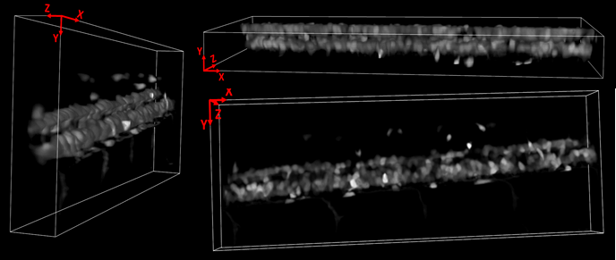
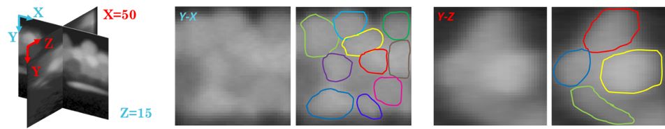
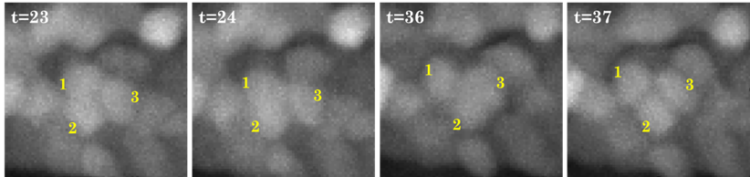
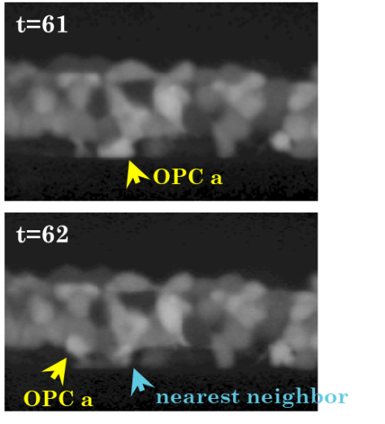
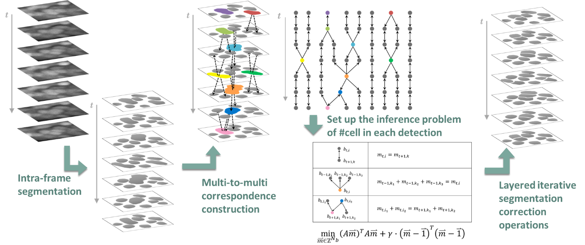
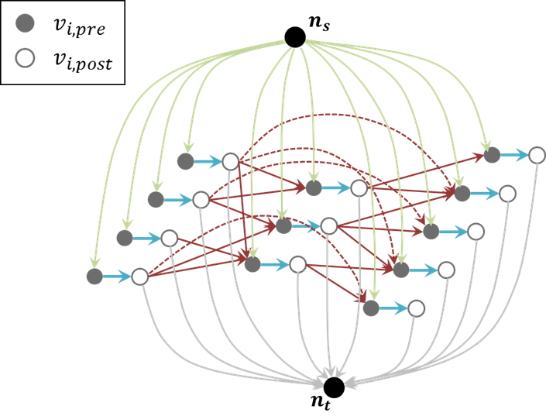
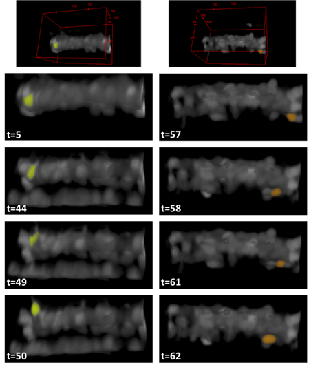
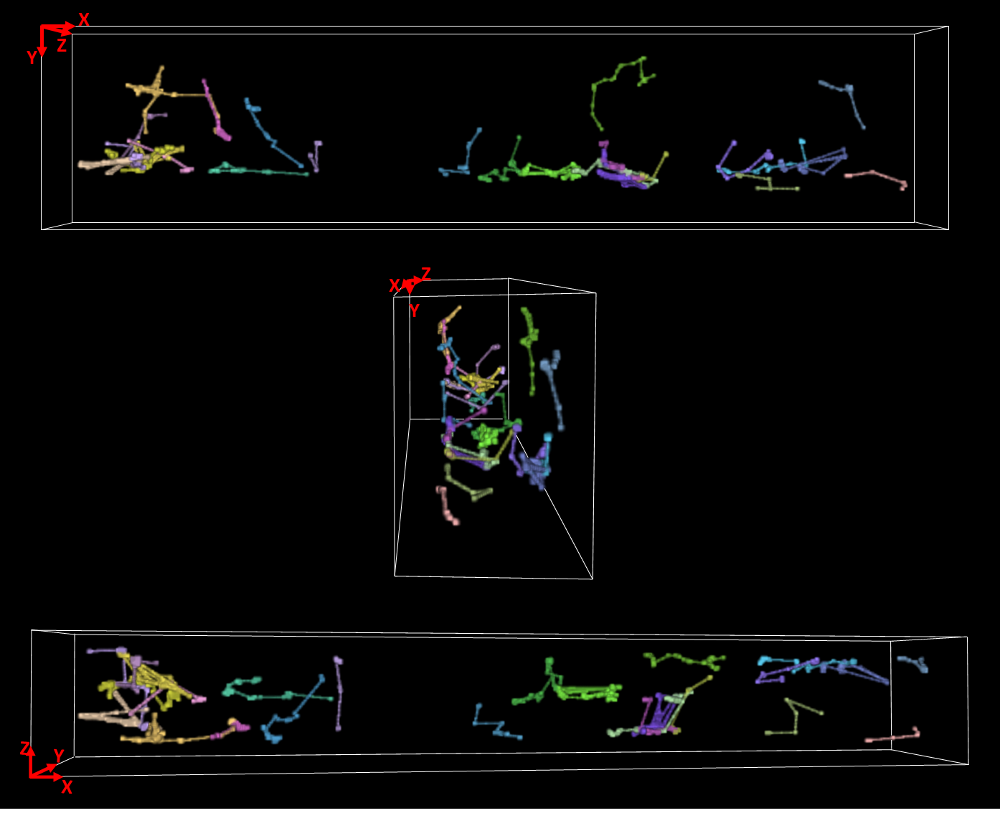

# MicTracker
MicTracker is a project as well as a software for automatic identification and tracking of migrating cells (OPCs) from 3D microscopic videos of live tissue including migrating cells (OPCs) and irrelevant non-migrating cells. It contains efforts to tackle exceptional difficulties in both segmentation and linking due to insufficient information.

# Data and Basic problem
Recent advances in optical microscopic imaging made it possible to monitor cell migration in live organisms like Zebra fish larvae. The migration of oligodendrocyte precursor cells (OPCs) is related to important brain functions hence got scientists’ attention, but manual tracking of migrating OPCs in 3D+t data is so labor-intensive or even inapplicable. **This project aims at automatic identification and tracking of OPCs from 3D videos of live tissue including migrating OPCs and irrelevant non-migrating cells.**

<!-- blank line -->
<figure class="video_container">

  <video controls="true" allowfullscreen="true" poster="img/Data_fig2.png" width="690" height="225">
  <source src="img/Data_v1.mp4" type="video/mp4">
  </video>

</figure>
<!-- blank line -->

# Exceptional difficulty

It is an exceedingly challenging tracking task due to: 

1) Insufficient information in textures, contrast and boundaries; 

2) Temporally unstable boundaries between touching neighbor cells (very harmful for linking, possibly connecting a bunch of cells in a “trace”); 

3) Lack of distinct appearance to recognize each cell + violation of common “small displacement” (i.e. “nearest neighbor”) assumption for linking;

4) “Nearest neighbor” assumption holds in each group of cells (fast moving OPC / locally vibrating non-OPC), but the label of motion type is not known beforehand.

# Segmentation with temporal refinement
We first conducted cell detection/segmentation in each frame to get detection candidates. After information enhancement by identifying good features and transforms, segmentation was done using our in-house spot detection algorithm [1]. 

[1] Wang, Yizhi, et al. "SynQuant: an automatic tool to quantify synapses from microscopy images." Bioinformatics 36.5 (2020): 1599-1606.

On the basis of single-frame segmentation, we built up multiple-to-multiple temporal relationships among detection candidates. By imposing temporal consistency on such relationships, false merging and false splitting were inferred and corrected iteratively.

# Linking with multi-motion model

To link the detections with consideration for different motion patterns of different cell groups, the probability of each detection being OPC or non-OPC was introduced into min-cost-flow linking framework as prior. Such probability was inferred/updated from both observed appearance changes and linking results in previous iteration.

$$P(x_l |x_i,Δt,s_i^{(fw)},s_j^{(bw)})=E_{r_{il}}[P(x_l,r_{il}|x_i,Δt,s_i^{(fw)},s_j^{(bw)})]$$
$$=P(x_l |x_i,Δt,r_{il}=1)P(r_{il}=1|s_i^{(fw)},s_j^{(bw)})$$
$$+P(x_l |x_i,Δt,r_{il}=0)P(r_{il}=0|s_i^{(fw)},s_j^{(bw)})$$

$s_i^{(fw)}$ is the characteristics of detection $i$ related to the inference of probability of $r_{i?}$; and $s_i^{(fw)}$ is that related to $r_{?i}$.

# Final results

<!-- blank line -->
<figure class="video_container">

  <video controls="true" allowfullscreen="true" poster="img/Result_fig1.png" width="682" height="225">
  <source src="img/Result_v1.mp4" type="video/mp4">
  </video>

</figure>
<!-- blank line -->

Each color highlights one detected migrating OPC (in 2D Y-X projection).

3D trajectories of tracked OPCs.
